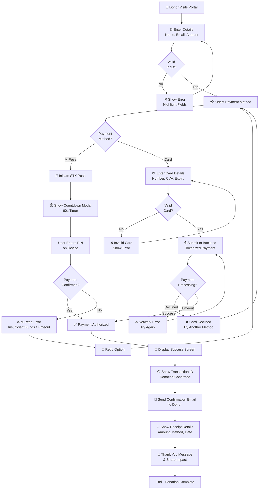

# MSF Donation Portal - Business Process Map

---

## Flow Breakdown

| Stage | Actor | Actions | Notes |
|-------|-------|---------|-------|
| **Entry** | Donor | Submits name, email, amount | Frontend validation only |
| **Selection** | Donor | Chooses M-Pesa or Card | Routes to payment flow |
| **M-Pesa Flow** | System | Triggers STK Push, shows 60s countdown | User enters PIN on phone |
| **Card Flow** | Donor | Fills card form | Backend tokenizes (mocked) |
| **Processing** | Backend | Validates, simulates payment | Returns success/failure |
| **Confirmation** | System | Shows Transaction ID, sends receipt | Builds trust, closing loop |

---

## Error Handling

- **Invalid input** → Loop back to form
- **Payment declined** → Option to retry with same/different method
- **Network timeout** → Retry button + support email fallback
- **M-Pesa timeout** → 60s countdown expires → Retry

---

## Key Design Decisions

1. **Validation split**: Frontend (UX) + Backend (security)
2. **STK Push simulation**: Countdown timer + manual confirm for demo
3. **Card mocking**: Test cards (4242, 4000) to avoid PCI scope
4. **Success feedback**: Transaction ID + simulated email = trust
5. **Error paths**: All errors allow retry or method change